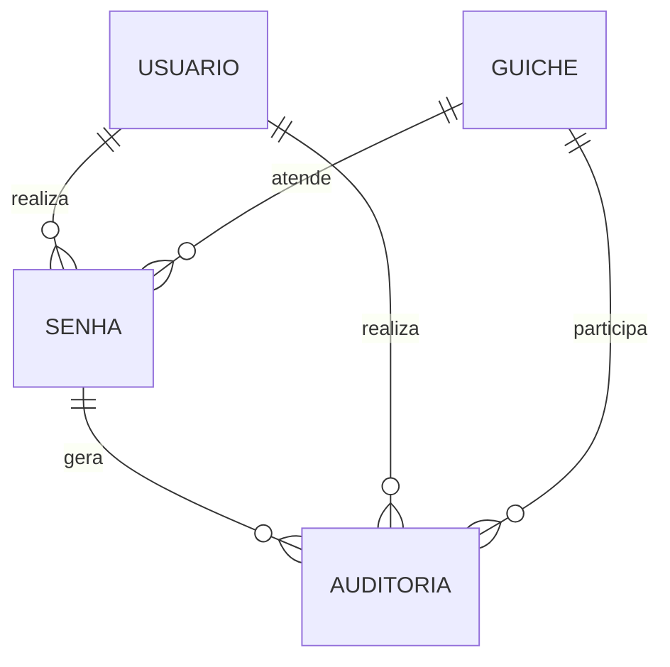

# Modelo Entidade-Relacionamento

## Entidades

### USUARIO
- id_usuario (PK)
- nome
- login
- senha_hash
- perfil
- ativo

### GUICHE
- id_guiche (PK)
- numero
- ativo

### SENHA
- id_senha (PK)
- numero
- tipo
- sequencia
- estado
- emitida_em
- primeira_chamada_em
- segunda_chamada_em
- inicio_atendimento_em
- fim_atendimento_em
- id_usuario (FK)
- id_guiche (FK)

### AUDITORIA
- id_auditoria (PK)
- id_senha (FK)
- id_usuario (FK)
- id_guiche (FK)
- evento
- realizado_em
- detalhes

## Relacionamentos

## Observação
O cliente é anônimo no totem, portanto não é necessário cadastrar uma entidade CLIENTE para atender à regra do projeto.
