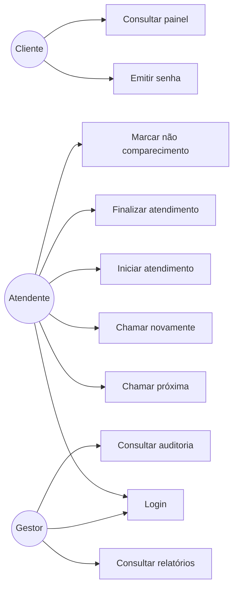

# UML — Diagrama de Casos de Uso

```mermaid
flowchart LR
    Cliente((Cliente))
    Atendente((Atendente))
    Gestor((Gestor))

    Cliente --> UC1[Emitir senha]
    Cliente --> UC2[Consultar painel]

    Atendente --> UC3[Login]
    Atendente --> UC4[Chamar próxima]
    Atendente --> UC5[Chamar novamente]
    Atendente --> UC6[Iniciar atendimento]
    Atendente --> UC7[Finalizar atendimento]
    Atendente --> UC8[Marcar não comparecimento]

    Gestor --> UC3
    Gestor --> UC9[Consultar relatórios]
    Gestor --> UC10[Consultar auditoria]
```
