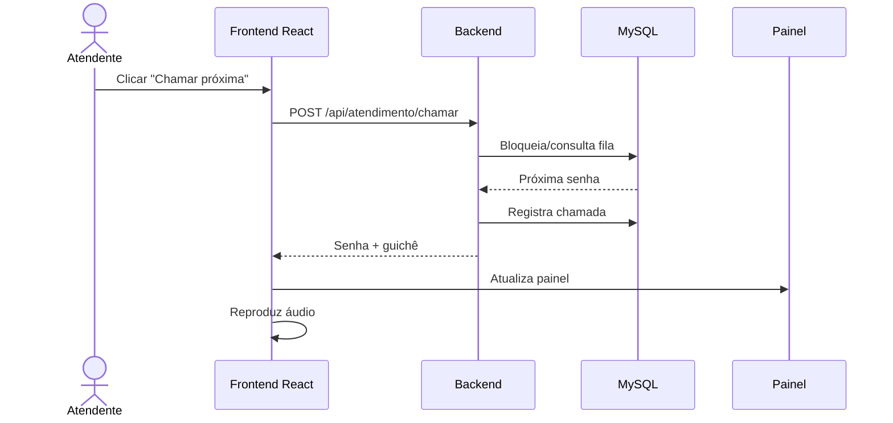

# UML — Sequência da chamada

```mermaid
sequenceDiagram
    actor A as Atendente
    participant F as Frontend React
    participant B as Backend
    participant DB as MySQL
    participant P as Painel

    A->>F: Clicar "Chamar próxima"
    F->>B: POST /api/atendimento/chamar
    B->>DB: Bloqueia/consulta fila
    DB-->>B: Próxima senha
    B->>DB: Registra chamada
    B-->>F: Senha + guichê
    F->>P: Atualiza painel
    F->>F: Reproduz áudio
```
